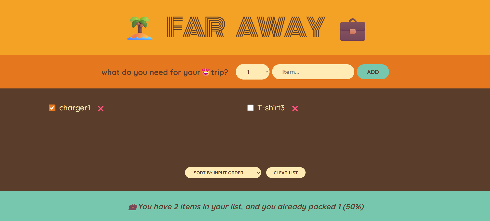

# 🏝️ Far Away – Packing List App

A simple React practice project for managing a travel packing list.

This project was built as a learning exercise to practice core React concepts such as state management, component structure, props, conditional rendering, and list operations.

## ✨ Features

- ➕ Add items with quantity
- ❌ Delete individual items from the list
- ✅ Mark items as packed / unpacked
- 🔄 Sort items by input order, description, or packed status
- 🗑️ Clear the entire list with confirmation
- 📊 Display live packing statistics (total items, packed items, percentage)

## 🛠️ Built With

- **React** (v18 or later)
- **JavaScript** (ES6+)
- **CSS3** (custom responsive styling)

## 📚 React Concepts Practiced

- Functional Components
- `useState` Hook
- Props
- State Lifting
- Component Composition
- Conditional Rendering
- List Rendering with `map()`
- Array Methods (`filter`, `sort`)

## 📸 Preview




## 🎯 Purpose

The main goal of this project is to strengthen React fundamentals by building a small, interactive, and practical UI application.

## ▶️ Getting Started

Follow these steps to run the project locally.

**1. Clone the repository**

```bash
git clone https://github.com/Abolfazl-Mohammadi-06/Todo-List.git
```
Install dependencies:

```bash
npm install
```

Start the development server:

```bash
npm start
```
## Live Demo

https://abolfazl-mohammadi-06.github.io/Todo-List/